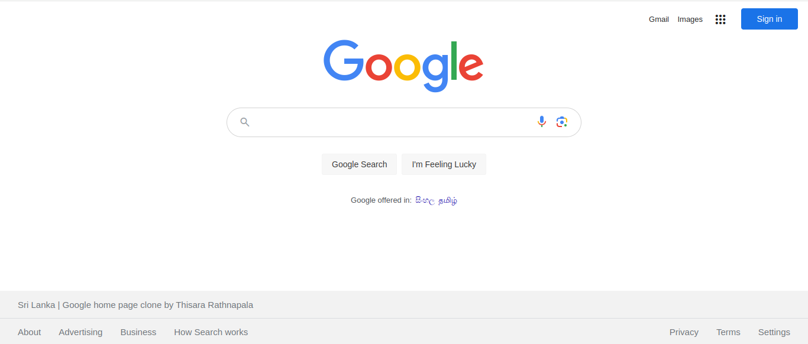

# Google Home Page Clone

A simple clone of the Google homepage to practice HTML and CSS skills. This project replicates the basic structure and styling of the Google homepage and includes a dark mode for the user's preference.

All product logos, designs, and trademarks, with the exception of the code, are copyrighted and belong to their respective owners.

## Project Preview-Light mode

## Project Preview-Dark mode

## Table of Contents
- [Features](#features)
- [Installation](#installation)
- [Usage](#usage)
- [License](#license)

## Features

- Accurate clone of the Google homepage.
- Responsive design for various screen sizes.
- Dark mode support using CSS media queries.

## Installation

To run this project locally, follow these steps:

1. Clone the repository to your local machine:
	git clone https://github.com/your-username/google-homepage-clone.git

2. Navigate to the project directory:
	cd google-homepage-clone

## Usage

1. Open the `index.html` file in your web browser to view the Google homepage clone.
2. You can interact with the search bar and buttons just like the real Google homepage.

## License

This project is open-source and available under the [MIT License](LICENSE.txt).

Feel free to fork, modify, and use the code in your own projects.

